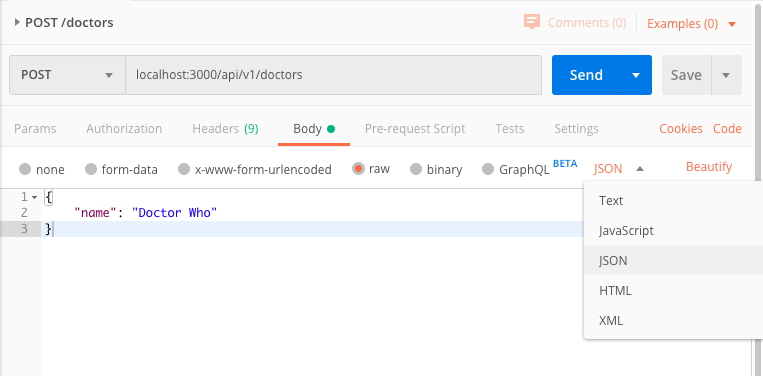

# REST Exercises

## Local Setup

1. Clone this repo.
1. Create your own repo (`<lan-id>-rest-api`) and copy over all the files in this repo (`README.md` optional).
1. Download the following:

- [Postman](https://www.getpostman.com/) to quickly send REST API requests and save them in a collection for testing.
- [JSONView Chrome Extension](https://chrome.google.com/webstore/detail/jsonview/chklaanhfefbnpoihckbnefhakgolnmc?hl=en) to better view your JSON responses in the browser.

## Goal

In these exercises, we will learn how to create a REST API using Express. We will also generate documentation for our API using Swagger.

There are a few approaches:

1. Write the API, create a `swagger.json` file that will be used by the Swagger UI.

1. Write the API, add documentation in the code to auto-generate the Swagger docs & UI.

We will be using the first approach, but a section below will also provide some detail on how the other approach can be done.

### Endpoints

At the end of this exercise, we should have the following endpoints:

- GET /doctors
- GET /doctors/:id
- POST /doctors
- GET /patients
- GET /patients/:id
- POST /doctors
- GET /visits (with query parameters)

## Hello World Basic Setup

First, let's get an Express server up and running. [Express](https://expressjs.com/) is a a minimal and flexible Node.js web application framework that will be serving up our REST endpoints.

1. In your local folder set up from the previous section, run `npm init -y` (defaults) to set up our `package.json` file.

1. Install `express`. We also need the following middleware:

   - `Middleware`: [Documentation](https://expressjs.com/en/guide/writing-middleware.html#:~:text=Middleware%20functions%20are%20functions%20that,middleware%20succeeding%20the%20current%20middleware.). Middleware functions are functions that have access to the request object (req), the response object (res), and the next function in the application’s request-response cycle. In case of Express, the next function is a function in the Express router which, when invoked, executes the middleware succeeding the current middleware.
   Middleware functions can perform the following tasks:
    * Execute any code.
    * Make changes to the request and the response objects.
    * End the request-response cycle.
    * Call the next middleware in the stack.

    

   - `body-parser`: [Documentation](https://www.npmjs.com/package/body-parser). Parses the HTTP request body, making it easier to access `request.body` in routes.

   - `cors`: [Documentation](https://www.npmjs.com/package/cors). Cross-Origin Resource Sharing (CORS) is a mechanism that uses additional HTTP headers to tell a browser to let a web application running at one origin (domain) have permission to access selected resources from a server at a different origin. A web application makes a cross-origin HTTP request when it requests a resource that has a different origin (domain, protocol, and port) than its own origin. To avoid running into cors issues when trying to call your REST service from the React UI we'll be creating later, ensure that your service allows cors.

   These 2 middleware will essentially run before the request gets to our endpoints.

   ```
   npm install express cors body-parser
   ```

1. In your folder (created from the Local Setup section), create a file called `index.js`. Add the following code (comments are added for explanation). This snippet was taken from Express documentation in [Getting Started](https://expressjs.com/en/starter/hello-world.html).

   ```js
   const express = require("express"); // importing the module
   const app = express(); // creating an Express app
   const port = 3000;

   // set up route for '/', http://expressjs.com/en/5x/api.html#res.send
   // this will show up on `localhost:3000` in the browser
   app.get("/", (request, response) => response.send("Hello World!"));

   // server will start listening for requests, the function is called immediately once the server is ready. Console.logs show up in your terminal.
   app.listen(port, () =>
     console.log(`Hello World, I'm listening on port ${port}!`)
   );
   ```

1. In `package.json`, add your start script

   ```json
   "start": "node index.js"
   ```

   Alternatively, you can install `nodemon` to watch for changes and avoid having to stop and start the server every time you make changes. Add a script to run in development that runs nodemon

   ```
   npm install nodemon
   ```

   ```json
   "dev": "nodemon index.js"
   ```

1. Run your app and navigate to `localhost:3000`. You should see your first "Hello World" example.

## Adding middleware

1. Our middleware (body-parser and cors) should run before the request goes to our endpoints. To set this up, add the following before the `app.get()`. You can read more about using middlewares with `app.use` in the [documentation](http://expressjs.com/en/5x/api.html#app.use).

   ```js
   const bodyParser = require("body-parser");
   const cors = require("cors");

   app.use(bodyParser.json()).use(cors());

   app.get("/", (request, response) => response.send("Hello World!"));
   ```

1. In the next exercises, you can try commenting out the `app.use` line to see how your routes are affected.

## Set up data as a module

1. In `data.js`, assign the object to a variable called data. Export the variable.

   ```js
   const data = { ... }
   module.exports = data;
   ```

1. In `index.js`, import the data module at the top.

   ```js
   const data = require("./data"); // the `./` denotes the folder structure
   ```

## Get a list of doctors (GET /doctors)

Let's set up an endpoint to retrieve a list of doctors `GET /doctors`. Here is the documentation for the methods we're using:

- [Response.json()](https://expressjs.com/en/4x/api.html#res.json)
- [App.get()](https://expressjs.com/en/4x/api.html#app.get.method).

It's convention to prefix routes with `/api/v1` to indicate the version.

In `index.js`, add the following after the first `app.get` line:

```js
app.get("/api/v1/doctors", (req, res) => res.json(data.doctors));
```

Navigate to your browser and go to `localhost:3000/api/v1/doctors` to see a list of doctors.

## Get a doctor by id (GET /doctors/:id)

Let's set up an endpoint to retrieve a doctor by id `GET /doctors/:id`. We're using the same methods as above, but now we can have access to the request parameters (id).

- [Request.params](https://expressjs.com/en/4x/api.html#req.params)

1. Set up the route. Parameters are denoted with a `:` prefix.

   ```js
   app.get("/api/v1/doctors/:id", (req, res) => {
     console.log(req.params); // returns an object with { id: '1' }
   });
   ```

1. Find the doctor from the `data` object and return it. We'll implement error handling later, follow the happy path for now. Note that the params passed are of String type, while our data has Number ids.

   ```js
   app.get("/api/v1/doctors/:id", (req, res) => {
     const id = parseInt(req.params.id);
     const doctor = data.doctors.find((doctor) => doctor.id === id);
     return res.json(doctor);
   });
   ```

1. Go to your browser and test out the route for `localhost:3000/api/v1/doctors/1`. Try another id.

### Using Postman

So far, we've been going to the browser to test the endpoints. We can also use Postman (and we will need it for POST requests in later sections).

1. Open up [Postman](https://www.getpostman.com/). You shouldn't need to sign in or create an account.

1. Create a New Collection, name it **REST API Exercises**.

1. Click on New -> New Request. Let's do the first GET /doctors request, so fill in the form with the request name, a description, and make sure it saves to the correct collection.

1. Choose the `GET` request through the dropdown and fill in the URL. Click **Send** to send the request. You should see the response JSON.

1. Create another request for the `GET /doctors/id` request.

## Adding a doctor (POST /doctors)

Let's set up an endpoint to add a doctor to our list. We're using these methods:

- [App.post()](https://expressjs.com/en/4x/api.html#app.post.method)
- [Request.body](https://expressjs.com/en/4x/api.html#req.body)
- [Response.status()](https://expressjs.com/en/4x/api.html#res.status)
- [HTTP Status Codes](https://en.wikipedia.org/wiki/List_of_HTTP_status_codes)

1. In `index.js`, add the POST request. We are adding the doctor details into our `data.doctors` list and assigning it an id.

   ```js
   app.post("/api/v1/doctors", (req, res) => {
     const nextId = data.doctors.length + 1;
     const doctor = { id: nextId, ...req.body };

     data.doctors.push(doctor);
     res.status(201).json(doctor); // 201 means Resource Created
   });
   ```

1. In Postman, set up a new POST request for the endpoint. Click on the Body tag (this is where your doctor information will be sent), click on the `raw` selection and click on the dropdown to select JSON. The screenshot below shows how it should be set up. Add a JSON object in the textarea with a `name` property.

   

1. Send the request, then check your doctors list with a GET request again. You should see the newly added doctor.

## Error Handling and Parameter Validation

We implemented the happy paths for our routes, but what could go wrong?

- In GET /doctors/:id, the id passed in the route could be letters
- In GET /doctors/:id , the id doesn't exist in `data`
- In POST /doctors, we don't check what details we're allowing.
- When there is an error, what should the response send back?

### Adding validation for the doctor id

Let's update the code to check if the id param sent in the request is a valid id. We're going to make the assumption that ids are numbers.

1. In your route for `app.get("/api/v1/doctors/:id")`, add a function to check for an invalid id. We're using the following methods:

   - [Number.isNaN()](https://developer.mozilla.org/en-US/docs/Web/JavaScript/Reference/Global_Objects/Number/isNaN)

   We're keeping the function inside the route for now to make the code-along easy to follow (everything in one file), but for separation of responsibilities, you may want to extract this logic to a Validator object.

   ```js
   const isInvalidId = (id) => {
     return Number.isNaN(parseInt(id, 10));
   };
   ```

1. In the next line, use the validator function, to check if it's an invalid ID. If not, return an error. We're using the following methods:

   - [Response.status()](https://expressjs.com/en/4x/api.html#res.status)
   - [HTTP Status Codes](https://en.wikipedia.org/wiki/List_of_HTTP_status_codes)

   ```js
   if (isInvalidId(req.params.id)) {
     return res.status(400).json({ error: "Invalid id." });
   }
   ```

1. We also want to check if the doctor with that id exists in the data. If not, return an error.

   ```js
   const id = parseInt(req.params.id, 10);
   const doctor = data.doctors.find((doctor) => doctor.id === id);

   if (!doctor) {
     return res.status(404).json({ error: "Doctor not found." });
   }
   ```

1. The route should now look like this:

   ```js
   app.get("/api/v1/doctors/:id", (req, res) => {
     const isInvalidId = (id) => {
       return Number.isNaN(parseInt(id, 10));
     };

     if (isInvalidId(req.params.id)) {
       return res.status(400).json({ error: "Invalid id." });
     }

     const id = parseInt(req.params.id, 10);
     const doctor = data.doctors.find((doctor) => doctor.id === id);

     if (!doctor) {
       return res.status(404).json({ error: "Doctor not found." });
     }

     return res.json(doctor);
   });
   ```

### Allowing specific properties for POST /doctors

Currently, our POST route is adding everything passed through the request body. We want to guard against bad data, as well as make sure the required information is there (such as the doctor's name).

1. Check for the existence of name in the body. If it doesn't exist, or it's empty, return an error.

   ```js
   if (!req.body.name) {
     return res.status(400).json({ error: "Doctor needs a name parameter." });
   }
   ```

1. Replace the spread operator `...req.body` with the properties you're allowing.

   ```js
   const doctor = { id: nextId, name: req.body.name };
   ```

## Individual Exercise: Add similar endpoints for the patients

- GET /patients
- GET /patients/:id
- POST /patients

Set up Postman requests for all three.

## Swagger Documentation

We provide a starter `swagger.json` file for you in the starter repo. Let's set it up to show our documentation.

1. Install the package for `swagger-ui-express`. This module allows you to serve auto-generated swagger-ui generated API docs from express, based on a swagger.json file. The result is living documentation for your API hosted from your API server via a route. [Documentation](https://www.npmjs.com/package/swagger-ui-express).

   ```bash
   npm install swagger-ui-express
   ```

1. In `index.js`, import the 2 modules you need.

   ```js
   const swaggerUi = require("swagger-ui-express");
   const swaggerDocument = require("./swagger.json");
   ```

1. Add a route to show the documentation.

   ```js
   app.use("/api/v1/docs", swaggerUi.serve, swaggerUi.setup(swaggerDocument));
   ```

1. Navigate to that route to see an interactive Swagger documentation.

1. Read up on the Swagger Documentation structure in their [documentation](https://swagger.io/docs/specification/basic-structure/). Using that structure, add API documentation for the patient routes.

## Get a list of visits by doctor id, patient id, or both

A visit is an object that contains the doctor id, patient id and a date. We can implement getting a list of visits based on either doctor or patient id, or both.

We can do this using a query string in our route. If there is no query string, we can return the full list of visits.

We'll be using these methods:

- [Request.query](https://expressjs.com/en/4x/api.html#req.query)

1. In `index.js`, set up the route.

   ```js
   app.get("/api/v1/visits", (req, res) => {
     console.log(req.query);
     return res.json(data.visits);
   });
   ```

1. Test the route on Postman to see what is returned by `req.query`. Your URL should look something like `localhost:3000/api/v1/visits?doctorid=1&patientid=1`. You can edit the query parameters through the Postman UI (or toggle them to be included or not).

1. Implement the logic to find the correct visits.

   ```js
   app.get("/api/v1/visits", (req, res) => {
     const { doctorid, patientid } = req.query;
     let visits = [];

     if (doctorid && patientid) {
       visits = data.visits.filter(
         (visit) =>
           visit.doctorid === parseInt(doctorid, 10) &&
           visit.patientid === parseInt(patientid, 10)
       );
     } else if (doctorid) {
       visits = data.visits.filter(
         (visit) => visit.doctorid === parseInt(doctorid, 10)
       );
     } else if (patientid) {
       visits = data.visits.filter(
         (visit) => visit.patientid === parseInt(patientid, 10)
       );
     } else {
       visits = data.visits;
     }

     return res.json(visits);
   });
   ```

## Update the Swagger docs

1. Update your Swagger documentation to account for the `visits` routes.

## Approach 2: Auto-generate Swagger UI based on documentation in code

This approach uses the [express-swagger-generator](https://www.npmjs.com/package/express-swagger-generator) package.

You use comments in the code to write the documentation. For example:

```js
/**
 * @typedef Patient
 * @property {string} id.required - Normally an auto increment number stored as string
 * @property {string} name.required - Full name
 */

/**
 * Get a single patient by ID
 * @route GET /patients/{id}
 * @group Patients
 * @param {string} id.path.required - Patient ID
 * @returns {Patient.model} 200 - Patient with requested ID
 * @returns {string} 404 - Requested patient not found
 * @produces application/json
 */
```

To set up swagger, add this to `index.js`

```js
const expressSwaggerGenerator = require("express-swagger-generator");
const host = `localhost:${port}`;
const basePath = "/"; // The forward slash is important!

// Options for the Swagger generator tool
const options = {
  // The root document object for the API specification
  // More info here: https://github.com/OAI/OpenAPI-Specification/blob/master/versions/2.0.md#schema
  swaggerDefinition: {
    info: {
      title: "Health Insurance API",
      description: "This is Web service for patients, doctors and visits.",
      version: "1.0.0",
    },
    host: host,
    basePath: basePath,
    produces: ["application/json"],
    schemes: ["http", "https"],
  },
  basedir: __dirname, // Absolute path to the app
  files: ["./routes/**/*.js"], // Relative path to the API routes folder to find the documentation
};

// Initialize express-swagger-generator and inject it into the express app
expressSwaggerGenerator(app)(options);
```

## Optional Individual Exercises

### Implement error handling for the GET /visits route

We did the happy path above. Take some time to implement error handling for when:

- Doctorid param is not a number
- Patientid param is not a number

### Pushing to PCF

Using what you learned in Day 1's PCF Course, push your application to PCF.

### Code organization: separate routes

Right now, we have endpoints for doctors, patients and visits all in one file in `index.js`. To organize our code, we can split these up into 3 high-level routes (one for each).

Use the following to set up a `routes` folder and refactor your code to be more organized. Keep in mind that refactoring means nothing should change behaviour-wise in your code.

- [Router](https://expressjs.com/en/4x/api.html#router)
- [express.Router](https://expressjs.com/en/4x/api.html#express.router)
- [A Guide to Routing](https://expressjs.com/en/guide/routing.html) - the last 2 sections on `app.route()` and `express.Router` are most relevant.

### Refactoring your code

There is a later course on "Refactoring Techniques", so this exercise is optional.

Extract the validations and logic within a route to separate class.
